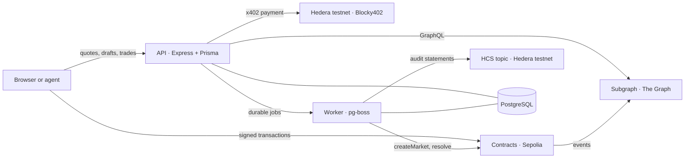

# Horizon

**A prediction market where the price is a program.** Makers publish executable pricing curves
instead of resting orders, one USDC balance backs quotes across every market, and new outcome
tokens are minted by matching complementary buyers rather than by seeding inventory.

[](https://github.com/horizon-market/horizon/actions/workflows/checks.yml)

**Trading has no fee of any kind** — no maker, taker, routing or protocol fee, only network gas.
The single charge in the product is the market-creation service fee: paid per request over Hedera
x402, and halved for a verified human.

> **Testnet preview.** Trading runs on Ethereum Sepolia with test USDC and creation payments
> settle on Hedera testnet. The contracts are unaudited, and resolution is performed by one
> disclosed address. Do not use real funds.

## What it does

- **Curve trading.** A maker publishes a curve — a start price, an end price and a size — that the
  chain evaluates on every fill. Equal start and end prices are simply a fixed-price limit order.
  Fills are partial and exactly accounted; a curve can be cancelled at any time.
- **One balance, many markets.** Quotes are backed by the maker's USDC through
  [1inch Aqua](https://1inch.io), so the same balance can support orders in several markets at
  once. Within a market, an admitted order carries a per-market budget enforced on chain, so a
  maker's resting orders can never commit more than the wallet can currently spend.
- **Markets that bootstrap themselves.** A YES buyer paying 0.60 USDC and a NO buyer paying 0.40
  USDC mint a fully backed pair in a single transaction. No one has to pre-mint inventory.
- **Atomic multi-curve routing.** An off-chain allocator selects up to four fills across direct
  and complementary legs; `RouteExecutor` settles the whole route or reverts it. Stale state,
  drained balances and slippage produce a clean rejection rather than a partial trade.
- **Live indexing.** Markets, curves, fills, collateral and resolutions are indexed by a Subgraph
  on [The Graph](https://thegraph.com) and served through the API, with a database mirror for
  fast reads that falls back to the indexer once it goes stale.
- **Creation as a paid service, for people and agents.** Drafting is grounded on live indexed
  markets and warns about duplicates; the requester reviews the draft before paying. Payment runs
  over [Hedera](https://hedera.com) x402 and is resumable — a retried request never charges twice
  and never creates two markets. A verified [World](https://world.org) credential reduces the
  charge, at most once per credential per day.
- **A publicly verifiable creation history.** Every approved draft, settled payment and deployed
  market is stated on a [Hedera](https://hedera.com) Consensus Service topic, in order, with a
  consensus timestamp anyone can read back from a mirror node. HCS records Horizon's statements and
  their ordering — it does not verify the payment, the deployment or any market outcome, and the
  product says so wherever the trail appears.
- **Events and imported definitions.** Several binary markets can be grouped under one title, one
  review and one payment, optionally imported from a Polymarket page. Imports copy **definitions
  only** — question, outcome labels, resolution criteria, evidence source and dates. Source
  prices, liquidity and settlement never become Horizon data.

## How a trade settles

1. The API reads candidate curves from the Subgraph and refreshes the live ones over RPC.
2. The allocator simulates the complete route — direct outcome fills, complementary mints, or a
   mix — under the trader's spending limit and deadline.
3. The trader signs one transaction. `RouteExecutor` performs each fill through `HorizonSwapVM`,
   pulling maker funds from Aqua and, where a route mints, locking 1 USDC of collateral per
   YES/NO pair in the market contract.
4. Every effect is atomic: a forged callback, an exhausted balance or a failed leg reverts the
   entire route.
5. After close, the disclosed resolver submits YES, NO or INVALID once, with an on-chain evidence
   reference. Winning tokens redeem 1 USDC; INVALID pays 0.50 USDC per outcome token.

## Architecture



| Component | Stack |
| --- | --- |
| Contracts | Solidity, Foundry, extending pinned official 1inch Aqua/SwapVM sources |
| API | Node 24, TypeScript, Express, Prisma, AdminJS for record inspection |
| Worker | A separate process on pg-boss: market creation, resolution, mirror sweeps and audit publication |
| Frontend | React 19, Vite, viem/wagmi, Hedera WalletConnect for payments |
| Indexing | A Subgraph deployed to The Graph Studio |
| Data | PostgreSQL 18 for requests, payments, sessions, jobs and the market mirror |

The API process serves the built frontend, so a deployment is two processes and one database.
`railway.json` configures that layout for Railway; nothing in the code is provider-specific.

## Repository layout

```
contracts/   Solidity sources, Foundry tests and the pinned Aqua/SwapVM vendor tree
src/         HTTP API, domain services, queue handlers and the worker entrypoint
web/         React frontend
subgraph/    Manifest and mappings for the indexer
prisma/      Schema and migrations
scripts/     Deployment, demo, resolution and read-only doctor commands
test/        Unit, PostgreSQL integration and Anvil end-to-end tests
docs/        Setup, architecture, public evidence and the design system
```

## Quick start

Requires Node 24.10.0 (`.nvmrc`), Docker for PostgreSQL, and Foundry 1.2.3 for the contract tests.

```sh
npm ci && npm --prefix web ci
npm run setup:local       # writes .env and .local/admin-password.txt; never overwrites .env
npm run db:up             # PostgreSQL on 127.0.0.1:54329, creates horizon and horizon_test
npm run db:generate && npm run db:migrate && npm run db:test:migrate
npm run web:build         # the API serves web/dist when it exists
npm run dev               # API and frontend
npm run worker:dev        # second terminal: creation, resolution and sync jobs
npm run stream:dev        # optional third terminal: live chain data over Substreams (STREAM_ENABLED=true and a credential)
```

The application is then at `http://127.0.0.1:3001`. Market data, quoting and creation stay
disabled until `EVM_RPC_URL`, the `HORIZON_*_ADDRESS` values and `GRAPH_QUERY_URL` are set;
`.env.example` documents every variable. Secrets live in `.env` and `.local/`, both git-ignored,
and no user wallet key is ever sent to the server.

Full instructions, configuration table and the deliberate write commands are in
[docs/SETUP.md](docs/SETUP.md).

## Verification

```sh
npm run typecheck && npm test          # TypeScript unit tests
npm run test:integration               # PostgreSQL tests: payments, idempotency, job durability, the live layer and SSE
npm run test:routes                    # Anvil end-to-end quote, simulation and execution
npm run contracts:test                 # Foundry suite, including fuzz properties
npm run vendor:verify                  # hashes of every pinned vendor file
npm run doctor                         # read-only sponsor and deployment readiness report
```

`doctor` never sends a payment, deploys a contract, or infers success from the presence of an
environment variable. The same suites run on every push through
[Foundation checks](.github/workflows/checks.yml).

## Deployments

Ethereum Sepolia (chain `11155111`), recorded in [deployments/sepolia.json](deployments/sepolia.json):

| Contract | Address |
| --- | --- |
| `MarketRegistry` | `0xa1151c78bf5ba0ce80b1f78626c4c0f2c7d131a1` |
| `HorizonSwapVM` (router) | `0x2b7592171cc7cfaa21dd60b49c81d68cf584302d` |
| `RouteExecutor` | `0x657b5cf110bed745c5b3f33c77d61855abb4cfa9` |
| `OrderBudget` | `0x563D51c62260F484C5765712fd9716704cF266A2` |
| 1inch Aqua | `0x1111113CCf1426A8E30e2bfF5E005d929bF6a90a` |
| Test USDC | `0x1c7D4B196Cb0C7B01d743Fbc6116a902379C7238` |

Audit trail: HCS topic [`0.0.10473191`](https://hashscan.io/testnet/topic/0.0.10473191) on Hedera
testnet, restricted to the audit signer's submit key.

Indexer: `https://api.studio.thegraph.com/query/1758973/horizon/0.3.2`.
Transactions, block numbers and live re-checks are listed in [docs/EVIDENCE.md](docs/EVIDENCE.md).

## Status

Demonstrated on public networks: an atomic two-curve route on Sepolia and its indexed result, a
public audit trail of thirteen statements on a Hedera Consensus Service topic — each read back
from the mirror node byte for byte, with the payment and market they reference verified at their
own sources — and an agent-owned client completing a paid creation end to end — 1 HBAR settled on Hedera testnet,
the market created on Sepolia under a creation id derived from its request id, and indexed by The
Graph. The frontend covers browsing, a market detail and order ticket, curve publishing, holdings
and redemption, the creation workflow and an operator screen.

World Selfie Check access has been granted for this app, and the verified-human path has run end
to end in Sandbox against the production deployment: the RP context, the widget, the server-side
`action`/`environment`/`signal_hash` checks and the nullifier record, followed by a creation paid
at the discounted price over Hedera x402.

Implemented but not yet exercised live: a browser-wallet Hedera settlement (the client renders
live payment requirements but has settled nothing). Drafting runs its deterministic provider,
labelled `development`, unless a model credential is configured; either way it is grounded on the
same live indexed markets.

## Disclosed roles and limits

This release is deliberately centralized in two places, both stated in the product UI:

- **Creation authority.** `MarketRegistry` has a single owner; anyone may *request* a market
  through the paid service, but only the owner calls `createMarket`. Transferring ownership
  changes future creation only — it can never alter an existing market's rules or resolver.
- **Resolution authority.** Every market takes that address as its immutable resolver, which may
  submit YES, NO or INVALID **once** after close, with a non-empty evidence reference recorded on
  chain. There is no dispute process and no timeout fallback.

Neither role can spend from a user's wallet, withdraw collateral, mint unbacked outcomes, or reset
a curve's filled counter. Out of scope by design: autonomous matching, automatic resale, routes
spanning different markets, shared collateral between grouped markets, decentralized disputes and
any mainnet deployment.

## Documentation

- [docs/SETUP.md](docs/SETUP.md) — requirements, first run, configuration, verification.
- [docs/ARCHITECTURE.md](docs/ARCHITECTURE.md) — processes, trust boundaries, curve trading,
  order budgets, the creation workflow, the x402 payment flow and the HCS audit trail.
- [docs/EVIDENCE.md](docs/EVIDENCE.md) — verified addresses and transactions, disclosed roles,
  check results and what remains outstanding.
- [docs/DESIGN_SYSTEM.md](docs/DESIGN_SYSTEM.md) — the interface language of the application.
- [contracts/README.md](contracts/README.md) — contract units, rounding, ABI entry points, event
  discovery and vendor provenance.
- [docs/ROADMAP.md](docs/ROADMAP.md) — build phases, product decisions and acceptance checks.

## Third-party sources and licence

The 1inch Aqua and SwapVM sources under `contracts/vendor` are pinned upstream copies, verified by
hash on every CI run (`npm run vendor:verify`) and covered by their own upstream licence; see
[contracts/README.md](contracts/README.md) for provenance. Horizon itself does not yet declare a
licence, so all rights are reserved until one is added.
